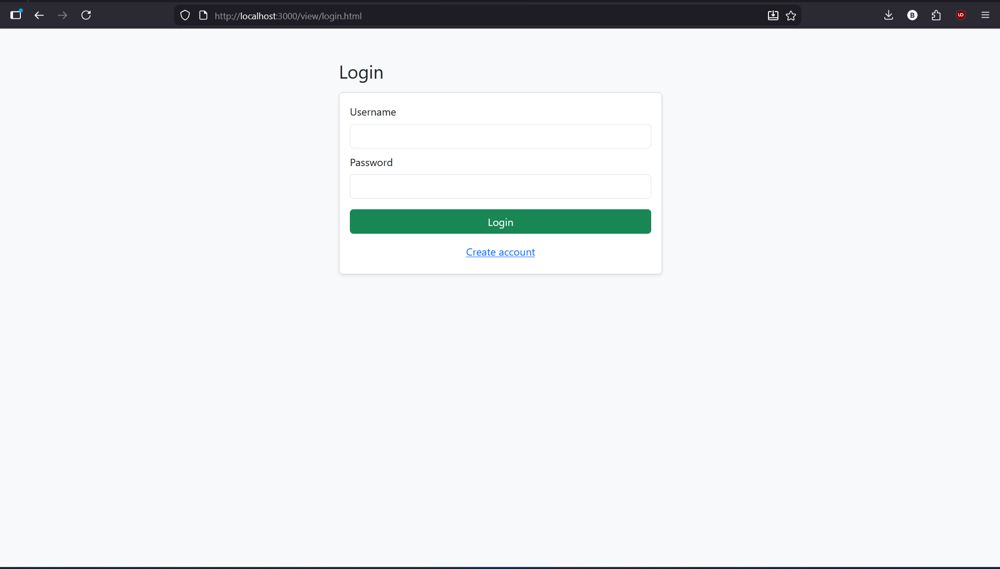
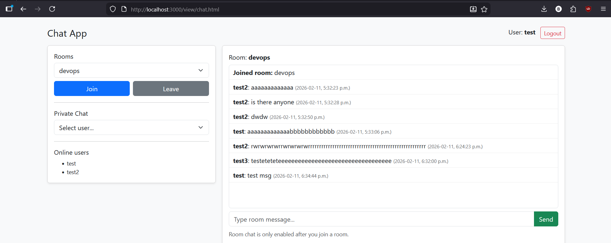
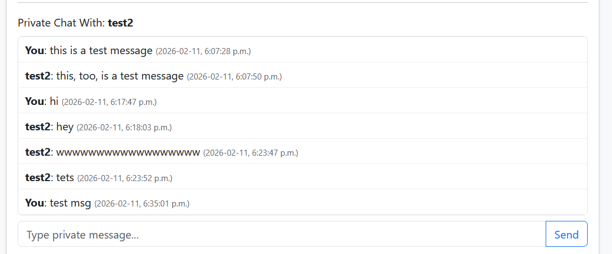

# COMP3133 Lab Test 1 — Real-Time Chat Application

## Student Information

**Name:** Bill Tran
**Student ID:** 101513060
**Course:** COMP3133 – Full Stack Development
**Assignment:** Lab Test 1

---

## Project Overview

This project is a real-time chat application built using **Node.js, Express, MongoDB Atlas, and Socket.io**.
It supports both **group chat rooms** and **private messaging between users**, with messages persisted in the database.

The application demonstrates full-stack development concepts including:

* REST API development
* Real-time communication
* Database integration
* Authentication
* Event-driven architecture

---

## Features

### User Authentication

* User signup with encrypted passwords (bcrypt)
* Login validation
* Session persistence using localStorage
* Unique username enforcement

---

### Chat Rooms

* Join and leave predefined chat rooms
* Broadcast messages to all users in the room
* Display typing indicators
* Load previous chat history from MongoDB

---

### Private Messaging

* One-to-one private chat between users
* Dedicated private chat panel
* Typing indicator for private conversations
* Automatic loading of message history
* Messages persist in MongoDB Atlas

---

### Online Users

* View currently connected users in real time

---

## Technologies Used

* **Node.js**
* **Express.js**
* **MongoDB Atlas**
* **Mongoose**
* **Socket.io**
* **Bootstrap 5**
* **jQuery**

---

## Installation & Setup

### 1. Clone the repository

```bash
git clone https://github.com/btran369/COMP3133-Lab-Test-1
cd COMP3133-Lab-Test-1
```

---

### 2. Install dependencies

```bash
npm install
```

---

### 3. Configure Environment Variables

Create a `.env` file in the root directory:

```
PORT=3000
MONGO_URI=your_mongodb_atlas_connection_string
```

---

### 4. Start the Server

```bash
node server.js
```

or (recommended):

```bash
npm run dev
```

---

### 5. Open the Application

```
http://localhost:3000
```

---

## Database

The application uses **MongoDB Atlas** for cloud-hosted storage.

Collections created automatically:

* Users
* GroupMessages
* PrivateMessages

---

## Screenshots

### 🔹 Login Page



---

### 🔹 Chat Room



---

### 🔹 Private Messaging



---

### 🔹 MongoDB Collections


---